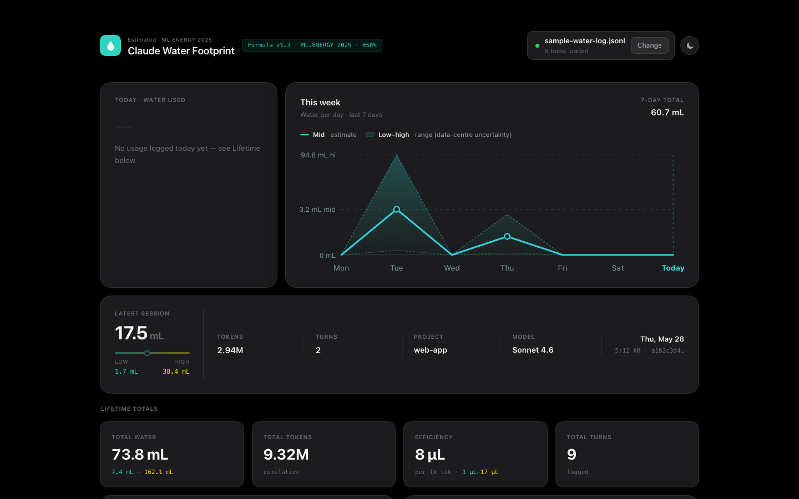

<div align="center">

# ThirstyLLM 💧

### Track the water footprint of your Claude usage locally, privately, with no API key.

[](https://pentasir.github.io/thirsty-llm/)
[](LICENSE)
[](#why-its-private-by-design)
[](#why-its-private-by-design)
[](https://ml.energy/leaderboard/)

**[Try the live dashboard →](https://pentasir.github.io/thirsty-llm/)**



</div>

Every prompt you send to a large language model runs on hardware in a data centre that's cooled with water. **ThirstyLLM** estimates how much, based on the methodology in Li et al. 2023, *["Making AI Less 'Thirsty'"](https://arxiv.org/abs/2304.03271)*.

It has two parts:

1. **Claude Code skill** that logs token usage per turn to a local file (`~/.claude/water-log.jsonl`) uses no network, no API key, just file I/O.
2. A **single-file dashboard** you open in your browser and drop that log onto — it renders your water footprint entirely client-side.

> [!NOTE]
> **Estimates carry ±50% uncertainty.** This is a directional tool, more tokens always means more water & not a precise meter. See [Methodology](#methodology). Independent open-source project; not affiliated with, endorsed by, or sponsored by Anthropic. "Claude" is a trademark of Anthropic.

## Contents

[Why it's private](#why-its-private-by-design) ·
[Install](#install) ·
[Use it](#use-it) ·
[How it works](#how-it-works) ·
[Methodology](#methodology) ·
[How it was built](#how-it-was-built) ·
[License](#license)

---

## Why it's private by design

The dashboard is the part people worry about. It isn't a website that takes your data — it's one HTML file that runs on your machine:

- **No API key, ever.** The skill reads token counts that Claude Code already writes to disk. Nothing is sent anywhere.
- **Zero network requests.** The dashboard ships a strict Content-Security-Policy (`default-src 'none'`) the browser is *structurally* forbidden from making any network call, even if the code were compromised.
- **No storage.** No `localStorage`, no cookies, no analytics. Close the tab and the data is gone.
- **Works fully offline.** Disconnect your wifi, double-click `index.html`, drop your log in and ThirstyLLM will still work. That's the proof: you can watch DevTools → Network show zero requests.
- **The log is just numbers.** Token counts, timestamps, model names, and the project directory name. No prompt content, no responses, no file contents.

---

## Install

Requirements: [Node.js](https://nodejs.org), Claude Code, and a Bash shell (built in on macOS/Linux; on Windows use **WSL** or **Git Bash** — see below).

```bash
git clone https://github.com/pentasir/thirsty-llm.git
cd thirsty-llm
bash install.sh
```

The installer copies the skill into `~/.claude/skills/water`, installs `formula.json`, and registers a `Stop` hook in `~/.claude/settings.json` (idempotent — safe to re-run). From then on, every completed turn logs one line to `~/.claude/water-log.jsonl`.

### Windows

Native Windows is supported — no WSL required. Use the PowerShell installer, which registers the Stop hook as a direct `node` command (no Bash involved):

```powershell
git clone https://github.com/pentasir/thirsty-llm.git
cd thirsty-llm
powershell -ExecutionPolicy Bypass -File .\install.ps1
```

It installs into `%USERPROFILE%\.claude` and logs to `%USERPROFILE%\.claude\water-log.jsonl`. View stats with `node "$env:USERPROFILE\.claude\skills\water\lib\show.mjs"`.

Prefer a Unix-like shell? **WSL** or **Git Bash** also work — run `bash install.sh` there instead, exactly as on macOS/Linux. Whichever you choose, run Claude Code from the **same** environment you installed into so the hook and log resolve to the same home directory. The dashboard (`index.html`) is just a static file, open it in any browser on any OS.

---

## Use it

**In the terminal** - see session / today / week / lifetime totals:

```bash
node ~/.claude/skills/water/lib/show.mjs
```

**In the dashboard** - visual breakdowns:

1. Open `index.html` in any browser (or the [live dashboard](https://pentasir.github.io/thirsty-llm/)).
2. Drag `~/.claude/water-log.jsonl` onto the drop zone. If you can't see this file it lives in your userfolder (in Mac) and you can press CMD+shift+G and type "~/.claude" to open Claude's directory file. You will find the water-log.jsonl file there.
3. Explore: today, last 7 days, lifetime, by model, by project, by session, and relatable comparisons (cups, bottles).

No log yet? Drop `examples/sample-water-log.jsonl` to see it populated with sample data.

---

## How it works

```
Claude Code session
      │  (Stop hook fires when a turn completes)
      ▼
skill/hook.sh → lib/log.mjs
      │  reads the session transcript, extracts token usage,
      │  appends ONE line of numbers (no prompt/response content)
      ▼
~/.claude/water-log.jsonl
      │  (drag & drop — never uploaded)
      ▼
index.html  →  parses locally, derives water from formula.json, renders
```

A log entry looks like this (numbers only):

```json
{"v":1,"formula_v":"1.2","ts":"2026-05-30T00:47:51Z","session":"924d2156…","model":"claude-sonnet-4-6","in":12,"out":1116,"cache_r":48236,"cache_w":70232,"project":"web-app","entrypoint":"cli"}
```

`formula.json` is the **single source of truth** for the calculation constants. Both the skill and the dashboard read the same numbers (the dashboard inlines a copy so it can run offline as a single file).

---

## Methodology

Water is derived from token counts through three steps. Full detail lives in [`skill/methodology.md`](skill/methodology.md) and inside the dashboard's "How we calculate" panel.

1. **Effective tokens:**  token types are weighted by relative compute cost (output `1.0×`, fresh input `0.20×`, cache write `0.25×`, cache read `0.001×`).
2. **Model multiplier:** derived from Anthropic's published output-token pricing as a compute proxy (Haiku `0.33×`, Sonnet `1.00×` baseline, Opus `1.67×`), verified against the live pricing page.
3. **Water rate:**  anchored to Li et al.'s empirical figure (~500 mL per ~30 conversations ≈ `0.014 mL` per effective token), reported as a **low / mid / high** range reflecting data-centre location uncertainty (WUE 0.18–4.0 L/kWh).

**Honesty notes:**
- Every figure is shown as a range, never a single fake-precise number.
- The pricing proxy includes margin, so multipliers are `±factor-of-2`.
- The empirical anchor was measured on GPT-3-class models; absolute magnitudes carry the ±50% band. Directional accuracy (Haiku < Sonnet < Opus) is preserved.
- Anthropic doesn't disclose which data centres handle inference, which is the largest source of uncertainty.

### Maintaining the pricing proxy

Model multipliers are derived at calculation time from the output-token prices in `formula.json`, so they can't drift from a hardcoded value. They *can* go stale if Anthropic changes prices. Before each release:

1. Re-check every price against [anthropic.com/pricing](https://www.anthropic.com/pricing).
2. Update `model_pricing_per_mtok_output_usd` and bump its `_checked` date.
3. Run `bash install.sh` to deploy, then `node ~/.claude/skills/water/lib/show.mjs --validate`. (Validate reads the installed `~/.claude/formula.json`, so deploy first.) It fails on structural errors (missing baseline, bad price, multiplier outside 0.01–10×) and warns if `_checked` is over 120 days old.

The self-test validates *arithmetic and structure*, not whether prices are current. Staleness is only catchable by a human, which is why step 1 is manual. (Four of six prices were once stale-but-plausible and the green check never noticed; see [BUILD-STORY.md](docs/BUILD-STORY.md).)

---

## How it was built

See [docs/BUILD-STORY.md](docs/BUILD-STORY.md) for motivation, architecture, the cache-read calibration problem, and how cross-model review shaped the release.

## Repo layout

```
thirsty-llm/
├── index.html          # the dashboard (single file, no build, no deps)
├── formula.json        # single source of truth for constants
├── skill/              # the Claude Code skill
├── install.sh          # deploys the skill into ~/.claude
├── examples/           # sample log to try the dashboard
└── docs/
    └── BUILD-STORY.md      # public build narrative
```

---

## License

[Apache License 2.0](LICENSE) © 2026 Jason K. Don

## Note:

I am not a technical person/coder - this was vibe coded because I was curious as to how much water is used per session (also why the whole thing is offline because I am not playing around with people's API keys or holding info on a website.
